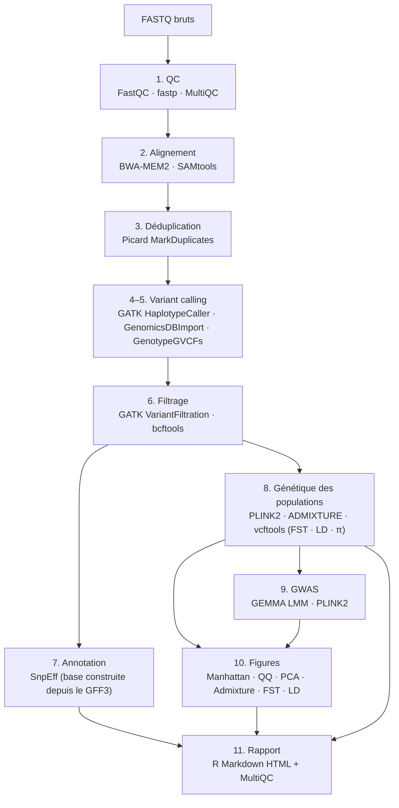

# honeybee-gwas-pipeline

[](https://github.com/romainkpakou/honeybee-gwas-pipeline/actions/workflows/ci.yml)
[](https://www.nextflow.io/)
[](https://www.docker.com/)
[](LICENSE)

**Pipeline WGS et GWAS de bout en bout pour la génomique des populations
d'*Apis mellifera mellifera* (abeille noire)**

> Auteur : Romain KPAKOU | Master 2 Bioinformatique, Nantes Université
> GitHub : [github.com/romainkpakou](https://github.com/romainkpakou)

---

## Vue d'ensemble

`honeybee-gwas-pipeline` est un pipeline Nextflow DSL2 entièrement automatisé
pour l'analyse WGS et les études d'association pangénomique (GWAS) appliquées
à *Apis mellifera mellifera*, la sous-espèce native d'Europe sous pression
de conservation. Il suit les GATK Best Practices pour le variant calling et
implémente des méthodes modernes de génomique des populations.

---

## Étapes du pipeline



Les étapes 7 (SnpEff) et 9 (GWAS) sont **conditionnelles** : SnpEff s'active si
un GFF3 est fourni, le GWAS si des phénotypes sont fournis.

---

## Prérequis

| Outil | Version | Installation |
|---|---|---|
| Nextflow | ≥ 24.04 | `curl -s https://get.nextflow.io \| bash` |
| Docker (ou Singularity) | — | [docs.docker.com](https://docs.docker.com) |
| Java | ≥ 17 | `sudo apt install default-jdk` |

Tous les outils bioinformatiques tournent dans des conteneurs
`quay.io/biocontainers` / `rocker` téléchargés automatiquement — aucune
installation manuelle. Reproductibilité : chaque conteneur est épinglé par tag.

---

## Démarrage rapide

### 1. Télécharger les données publiques

```bash
# Génome Amel_HAv3.1 + annotation GFF3 + N échantillons WGS (PRJNA473480)
bash bin/download_data.sh 5
```

### 2. Démonstration (5 échantillons)

```bash
# Bout-en-bout avec filtres relâchés — résultats sans valeur biologique
nextflow run main.nf -profile test,docker -resume
```

### 3. Analyse réelle

```bash
# 1. renseigner la colonne 'phenotype' du samplesheet.csv (trait mesuré)
# 2. ajuster conf/params.yml (filtres QC de production, ressources)
nextflow run main.nf -params-file conf/params.yml -profile docker  -resume   # machine unique
nextflow run main.nf -params-file conf/params.yml -profile slurm   -resume   # cluster HPC
```

Guide détaillé : [`docs/running_a_real_cohort.md`](docs/running_a_real_cohort.md)

---

## Format du samplesheet

```csv
sample,fastq_1,fastq_2,sex,population,phenotype
AMM_FR_001,data/samples/SRR7190186_1.fastq.gz,data/samples/SRR7190186_2.fastq.gz,unknown,AMM,62.5
AMM_UK_001,data/samples/SRR7190189_1.fastq.gz,data/samples/SRR7190189_2.fastq.gz,unknown,AMM,45.0
```

La colonne **`phenotype`** est optionnelle :

- **présente avec au moins une valeur** → l'étape GWAS (GEMMA LMM + PLINK2 +
  Manhattan/QQ) est activée automatiquement ; valeur vide ou `NA` = individu
  exclu de l'association.
- **absente** (ou `--phenotype_file` non fourni) → le GWAS est ignoré, le reste
  du pipeline s'exécute normalement.

Alternative : `--phenotype_file` pointant vers un fichier `sample,valeur` ou
`FID IID valeur`.

---

## Résultats

```
results/
├── 01_qc/          FastQC, fastp, MultiQC
├── 02_alignment/   BAM triés et dédupliqués
├── 03_variants/    VCF filtré + VCF annoté SnpEff (ANN=) + rapport d'effets
├── 04_population/   PCA, ADMIXTURE (K=2..5), FST, LD decay, diversité π
├── 05_gwas/         kinship, GEMMA LMM, PLINK2, Manhattan + QQ plots
├── 06_report/       rapport HTML de synthèse (R Markdown)
└── pipeline_info/   Nextflow report, timeline, trace, DAG
```

---

## Paramètres principaux

| Paramètre | Défaut | Description |
|---|---|---|
| `--maf` | 0.05 | Seuil fréquence allélique mineure |
| `--geno` | 0.05 | Taux max de génotypage manquant par SNP |
| `--mind` | 0.10 | Taux max de génotypage manquant par individu |
| `--hwe` | 1e-6 | Seuil Hardy-Weinberg |
| `--ld_r2` | 0.2 | Seuil r² pour l'élagage LD |
| `--admixture_k` | `2,3,4,5` | Valeurs de K à tester |
| `--gff` | `Amel_HAv3.1.gff.gz` | Annotation GFF3 → active SnpEff (vide = désactivé) |
| `--pca_components` | 20 | Nombre de PC (doit être `<` nombre d'individus) |
| `--plink_bad_ld` | `false` | Forcer l'élagage LD si `< 50` individus |
| `--hwe_filter` | `false` | Filtrage HWE (déconseillé en population structurée) |
| `--phenotype_file` | `null` | Fichier phénotypes (sinon colonne `phenotype` du samplesheet) |
| `--gwas_model` | `lmm` | Modèle GWAS : `lmm` (GEMMA) ou `logistic` (trait binaire) |
| `--gwas_pval` | 1e-6 | Seuil de significativité GWAS |
| `--max_cpus` / `--max_memory` / `--max_time` | 8 / 14.GB / 72.h | Plafonds appliqués à toutes les tâches |

Tous les paramètres sont modifiables dans `conf/params.yml`.

---

## Données utilisées

| Ressource | Accession | Référence |
|---|---|---|
| Données WGS | PRJNA473480 | Wallberg et al. (2019) *Nat Ecol Evol* |
| Génome référence | GCF_003254395.2 | Amel_HAv3.1 — 16 chromosomes + mito |
| Annotation | NCBI Release 104 | GFF3, base SnpEff construite localement |

---

## Statut

- **Pipeline** : fonctionnel de bout en bout, testé en CI (`nextflow lint` +
  run `-stub` complet) et sur le jeu de démonstration (5 génomes, `-profile test`).
- **Jeu de démonstration** : filtres QC volontairement relâchés — les résultats
  GWAS/popgen sont un test technique, **pas une analyse biologique**.
- **Analyse réelle** : suivre [`docs/running_a_real_cohort.md`](docs/running_a_real_cohort.md)
  (≥ 20–30 génomes, phénotypes, paramètres de production).

---

## Citation
Romain KPAKOU (2026). *honeybee-gwas-pipeline: End-to-end WGS/GWAS pipeline
for* Apis mellifera mellifera *population genomics*. v1.0.0.
https://github.com/romainkpakou/honeybee-gwas-pipeline

---

## Licence

MIT — voir [LICENSE](LICENSE)

---

## Contact

**Romain KPAKOU**
Master 2 Bioinformatique, Biostatistique & Biologie Computationnelle
Nantes Université
kpakouromain@gmail.com | [github.com/romainkpakou](https://github.com/romainkpakou)
